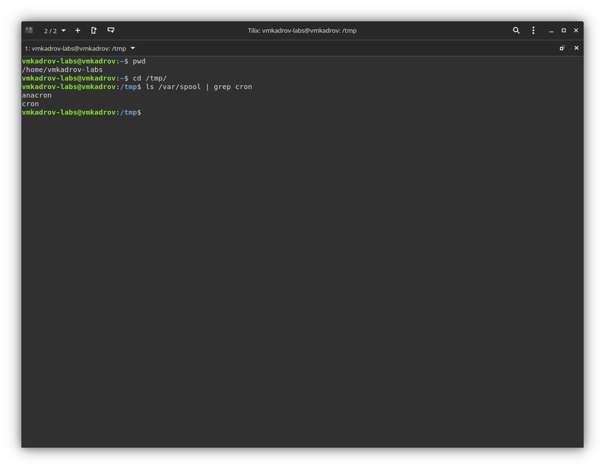
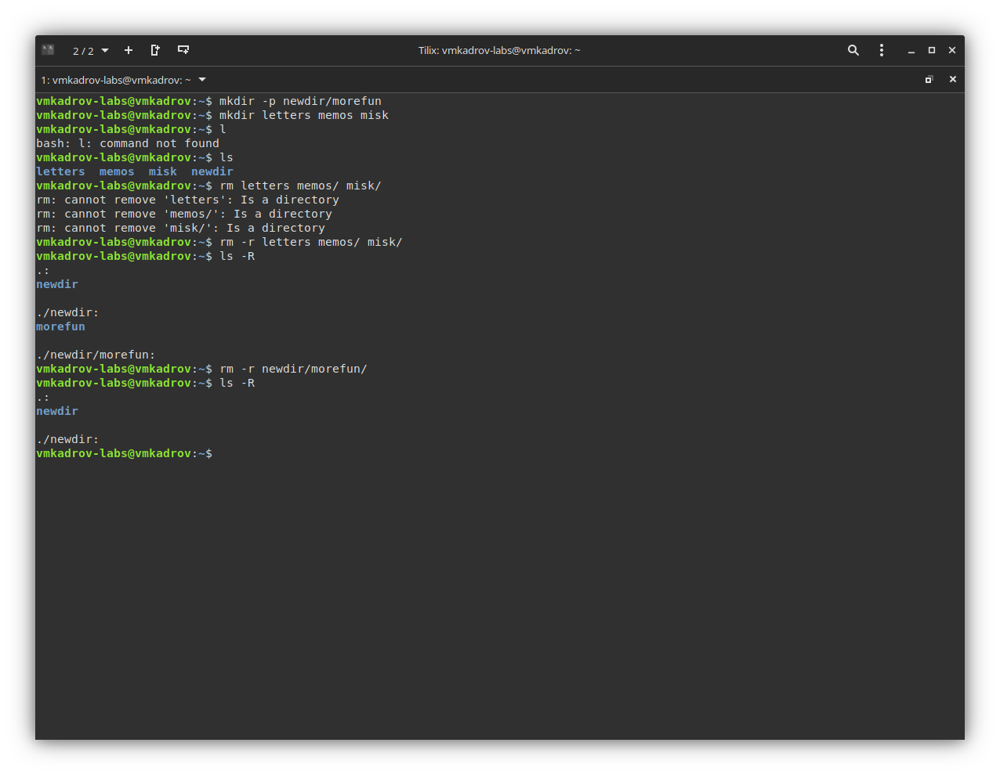
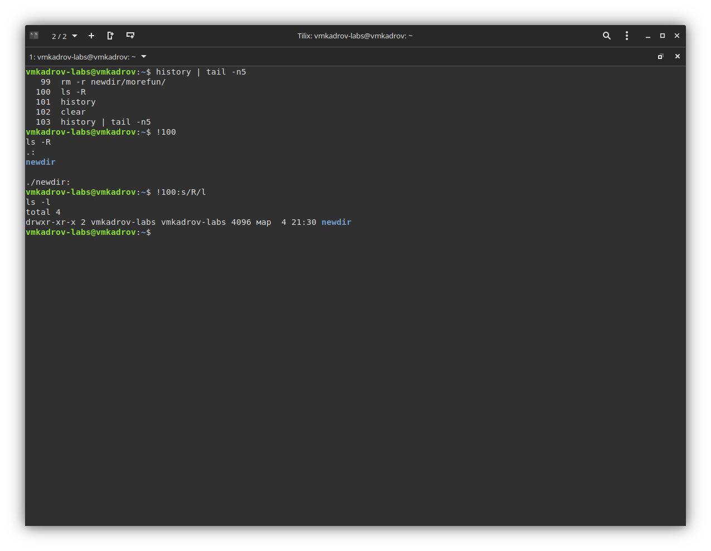

---
## Front matter
lang: ru-RU
title: Лабораторная работа №4
subtitle: Основы интерфейса взаимодействия пользователя с системой Unix на уровне командной строки
author:
  - Кадров В.М.
institute:
  - Российский университет дружбы народов, Москва, Россия
date: 04 марта 2023

## i18n babel
babel-lang: russian
babel-otherlangs: english

## Formatting pdf
toc: false
toc-title: Содержание
slide_level: 2
aspectratio: 169
section-titles: true
theme: metropolis
header-includes:
 - \metroset{progressbar=frametitle,sectionpage=progressbar,numbering=fraction}
 - '\makeatletter'
 - '\beamer@ignorenonframefalse'
 - '\makeatother'
---

# Цель работы

Приобретение практических навыков взаимодействия пользователя с системой посредством командной строки.

# Задание

1. Перемещеие по директориям
2. Создание и удаление директорий
3. Утилита history

# Теоретическое введение

В операционной системе типа Linux взаимодействие пользователя с системой обычно осуществляется с помощью командной строки посредством построчного ввода команд. При этом обычно используется командные интерпретаторы языка shell: /bin/sh; /bin/csh; /bin/ksh.

Командой в операционной системе называется записанный поспециальным правилам текст (возможно с аргументами), представляющий собой указание на выполнение какой-либо функций (или действий) в операционной системе.
Обычно первым словом идёт имя команды, остальной текст — аргументы или опции,конкретизирующие действие.
Общий формат команд можно представить следующим образом: <имя_команды><разделитель><аргументы>

# Выполнение лабораторной работы

## Перемещение по директориям

Для начала узнаем полный путь до своей домашней директории, используя команду pwd. Затем переходим в /var/spoon и проверяем наличие cron/.

{ #fig:001 width=100% }

## Создание и удаление директорий

Создаем newdir/morefun и три других директории. Проверяем, что они были созданы. Удаляем при помощи rm с ключом -r.

{ #fig:002 width=100% }

## Утилита history

Узнаем историю команд при помощи history. Выполняем их без и с использованием подстановки.

{ #fig:003 width=100% }

# Выводы

В ходе выполнения лабораторной работы были приобретены практические навыки взаимодействия пользователя с системой посредством командной строки.
