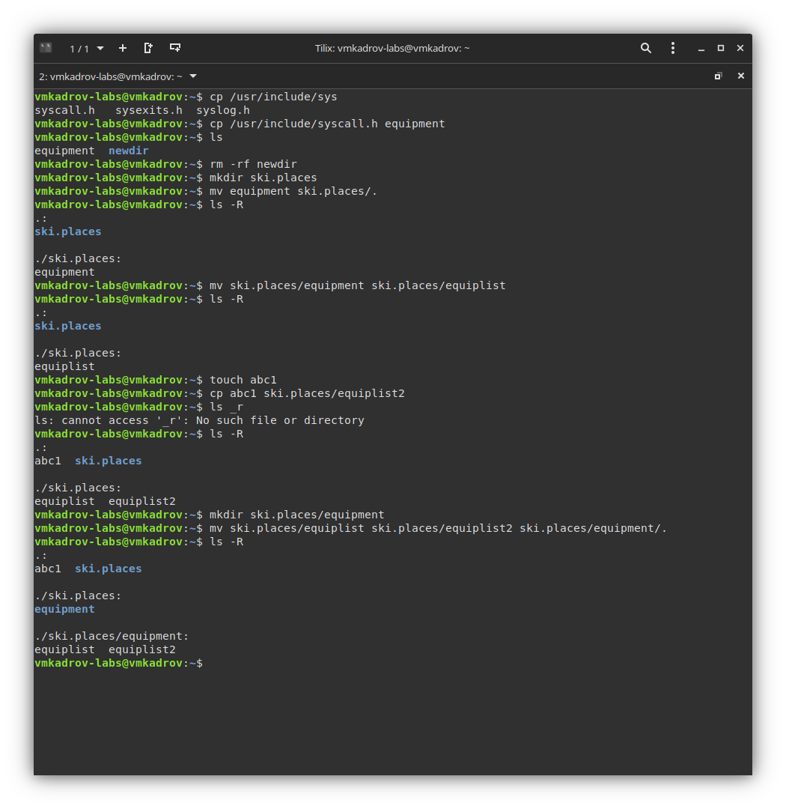
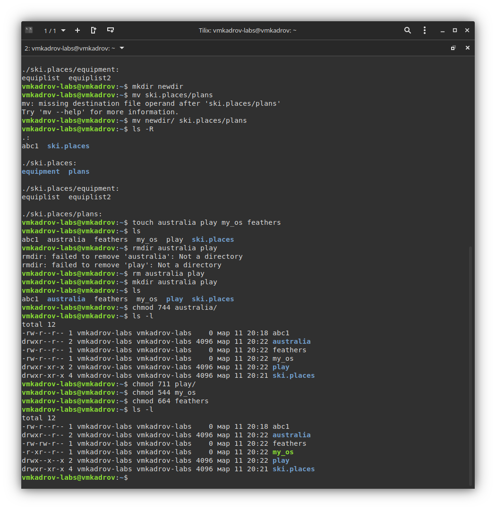
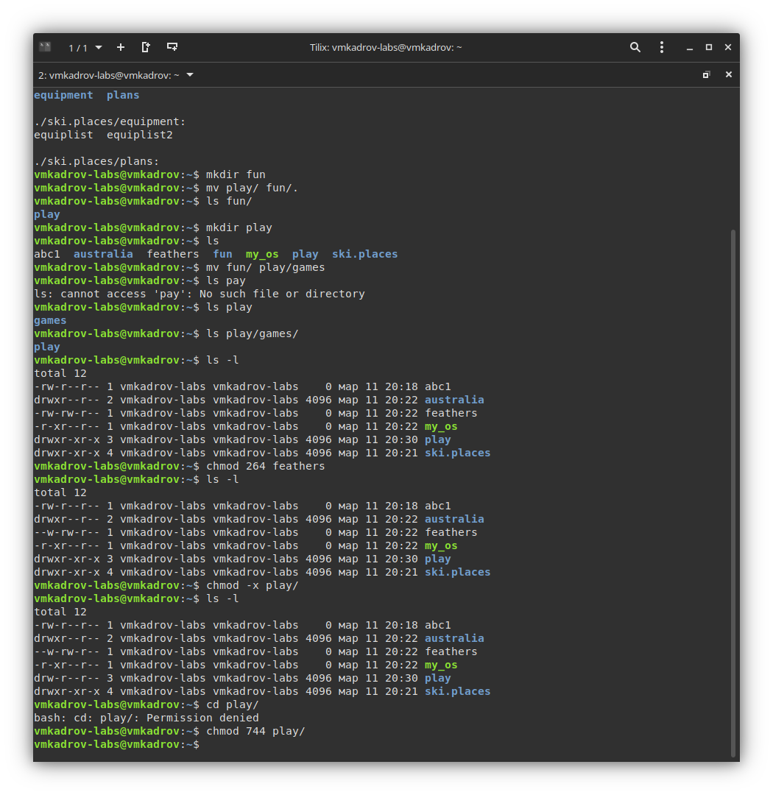

---
## Front matter
lang: ru-RU
title: Лабораторная работа №5
subtitle: Анализ файловой системы Linux. Команды для работы с файлами и каталогами"
author:
  - Кадров В.М.
institute:
  - Российский университет дружбы народов, Москва, Россия
date: 11 марта 2023

## i18n babel
babel-lang: russian
babel-otherlangs: english

## Formatting pdf
toc: false
toc-title: Содержание
slide_level: 2
aspectratio: 169
section-titles: true
theme: metropolis
header-includes:
 - \metroset{progressbar=frametitle,sectionpage=progressbar,numbering=fraction}
 - '\makeatletter'
 - '\beamer@ignorenonframefalse'
 - '\makeatother'
---

# Цель работы

Ознакомление с файловой системой Linux, её структурой, именами и содержанием каталогов. Приобретение практических навыков по применению команд для работы с файлами и каталогами, по управлению процессами (и работами), по проверке использования диска и обслуживанию файловой системы.

# Задание

1. Создание и перемещение директорий
2. Работа с правами доступа
3. Перемещение директорий и изменение прав

# Выполнение лабораторной работы

## Создание и перемещение директорий

Создадим необходимые директории и совершим действия над ними.

{ #fig:001 width=100% }

## Работа с правами доступа

Создадим две директории и два файла и дадим нужные права при помощи команды chmod.

{ #fig:002 width=100% }

## Перемещение директорий и изменение прав

Проведем необходимые манипуляции над нашими папками.

{ #fig:003 width=100% }

# Выводы

В ходе выполнения лабораторной работы были приобретены практические навыки по применению команд для работы с файлами и каталогами, по управлению процессами (и работами), по проверке использования диска и обслуживанию файловой системы.
