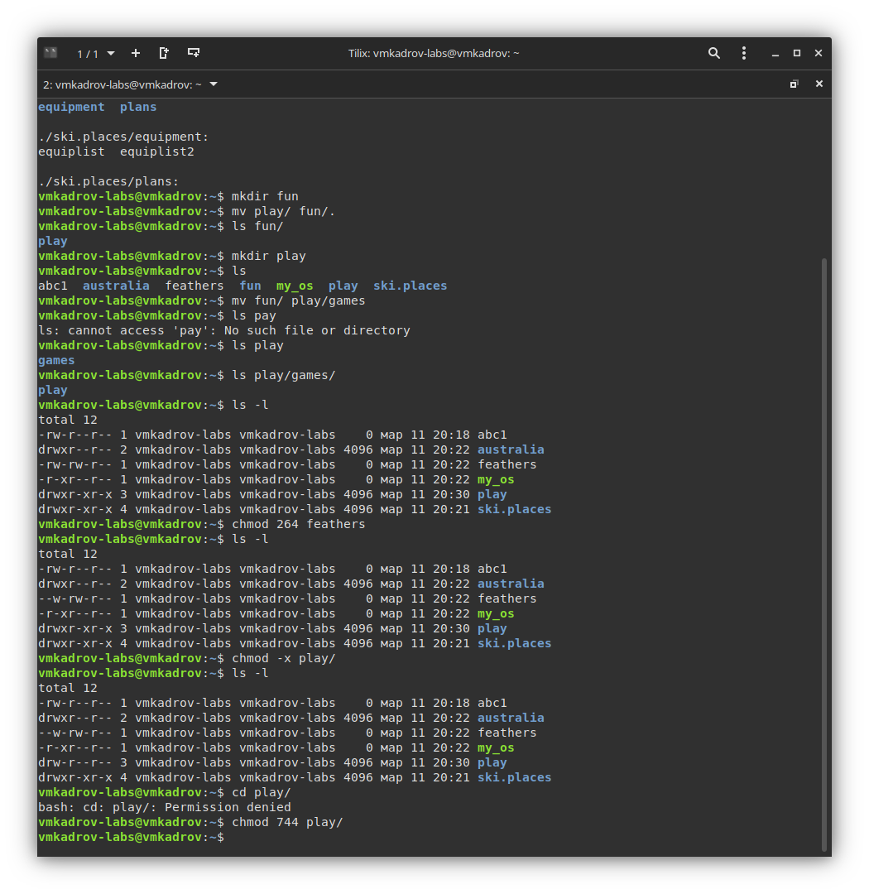

---
## Front matter
title: "Лабораторная работа №5"
subtitle: "Анализ файловой системы Linux. Команды для работы с файлами и каталогами"
author: "Виктор Максимович Кадров"

## Generic otions
lang: ru-RU
toc-title: "Содержание"

## Bibliography
bibliography: bib/cite.bib
csl: pandoc/csl/gost-r-7-0-5-2008-numeric.csl

## Pdf output format
toc: true # Table of contents
toc-depth: 2
lof: true # List of figures
lot: false # List of tables
fontsize: 12pt
linestretch: 1.5
papersize: a4
documentclass: scrreprt
## I18n polyglossia
polyglossia-lang:
  name: russian
  options:
	- spelling=modern
	- babelshorthands=true
polyglossia-otherlangs:
  name: english
## I18n babel
babel-lang: russian
babel-otherlangs: english
## Fonts
mainfont: PT Serif
romanfont: PT Serif
sansfont: PT Sans
monofont: PT Mono
mainfontoptions: Ligatures=TeX
romanfontoptions: Ligatures=TeX
sansfontoptions: Ligatures=TeX,Scale=MatchLowercase
monofontoptions: Scale=MatchLowercase,Scale=0.9
## Biblatex
biblatex: true
biblio-style: "gost-numeric"
biblatexoptions:
  - parentracker=true
  - backend=biber
  - hyperref=auto
  - language=auto
  - autolang=other*
  - citestyle=gost-numeric
## Pandoc-crossref LaTeX customization
figureTitle: "Рис."
tableTitle: "Таблица"
listingTitle: "Листинг"
lofTitle: "Список иллюстраций"
lotTitle: "Список таблиц"
lolTitle: "Листинги"
## Misc options
indent: true
header-includes:
  - \usepackage{indentfirst}
  - \usepackage{float} # keep figures where there are in the text
  - \floatplacement{figure}{H} # keep figures where there are in the text
---

# Цель работы

Ознакомление с файловой системой Linux, её структурой, именами и содержанием каталогов. Приобретение практических навыков по применению команд для работы с файлами и каталогами, по управлению процессами (и работами), по проверке использования диска и обслуживанию файловой системы.

# Задание

1. Создание и перемещение директорий
2. Работа с правами доступа
3. Перемещение директорий и изменение прав

# Теоретическое введение

Для создания текстового файла можно использовать команду touch. Для просмотра файлов небольшого размера можно использовать команду cat. Команда cp используется для копирования файлов и каталогов.
Команды mv и mvdir предназначены для перемещения и переименования файлов
и каталогов.

Каждый файл или каталог имеет права доступа (табл. 5.1).
В сведениях о файле или каталоге указываются:
– тип файла (символ (-) обозначает файл, а символ (d) — каталог);
– права для владельца файла (r — разрешено чтение, w — разрешена запись, x — разре-
шено выполнение, - — право доступа отсутствует);
– права для членов группы (r — разрешено чтение, w — разрешена запись, x — разрешено
выполнение, - — право доступа отсутствует);
– права для всех остальных (r — разрешено чтение, w — разрешена запись, x — разрешено
выполнение, - — право доступа отсутствует).

# Выполнение лабораторной работы

## Создание и перемещение директорий

Создадим необходимые директории и совершим действия над ними.

{ #fig:001 width=100% }

## Работа с правами доступа

Создадим две директории и два файла и дадим нужные права при помощи команды chmod.

{ #fig:002 width=100% }

## Перемещение директорий и изменение прав

Проведем необходимые манипуляции над нашими папками.

{ #fig:003 width=100% }

# Выводы

В ходе выполнения лабораторной работы были приобретены практические навыки по применению команд для работы с файлами и каталогами, по управлению процессами (и работами), по проверке использования диска и обслуживанию файловой системы.

