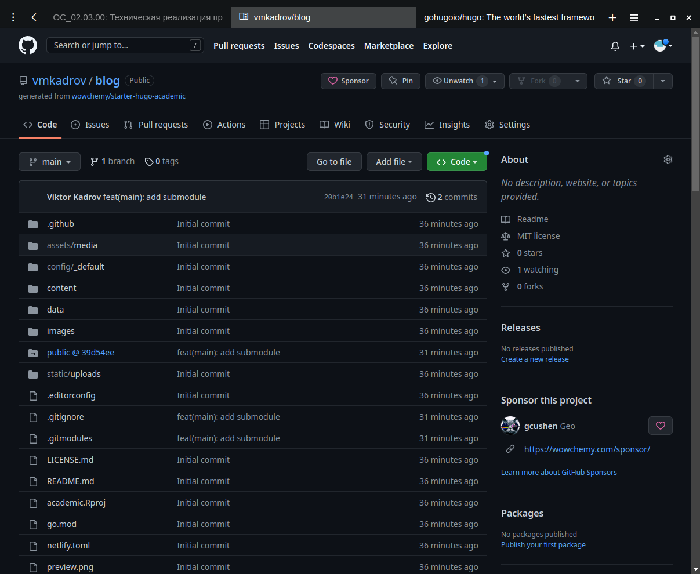
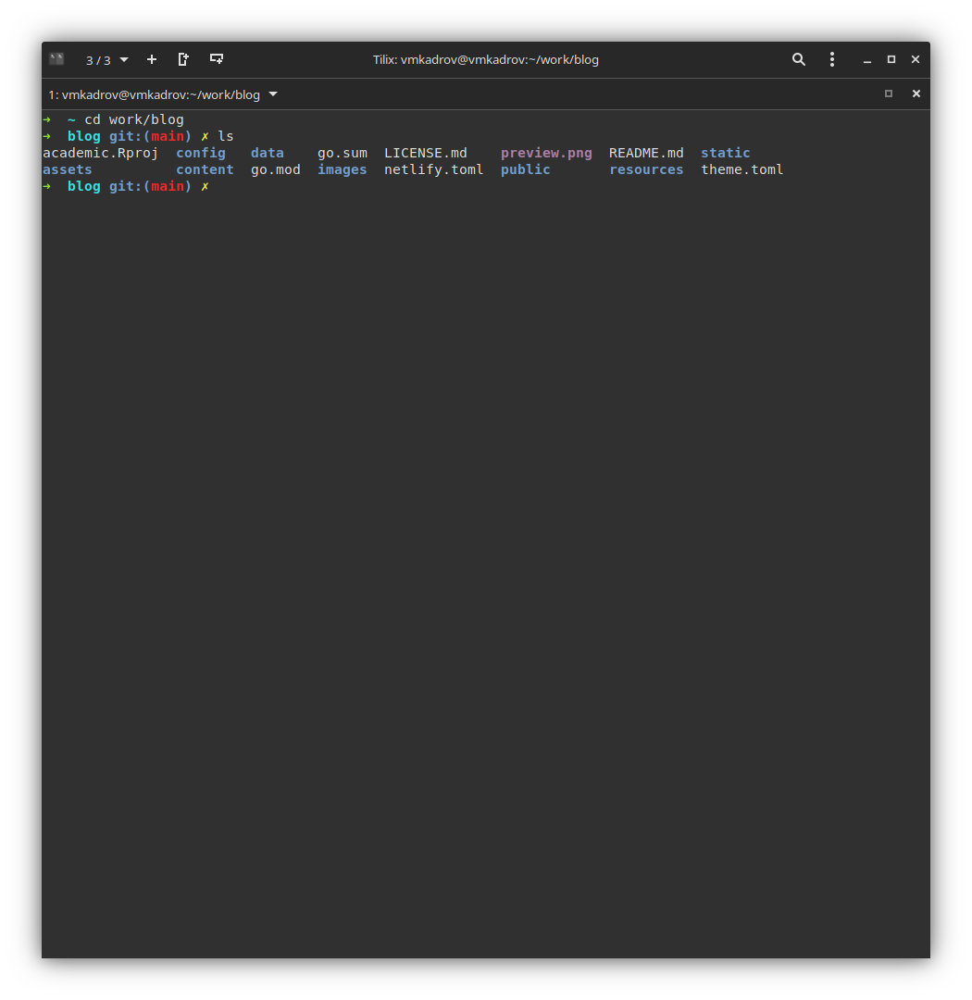
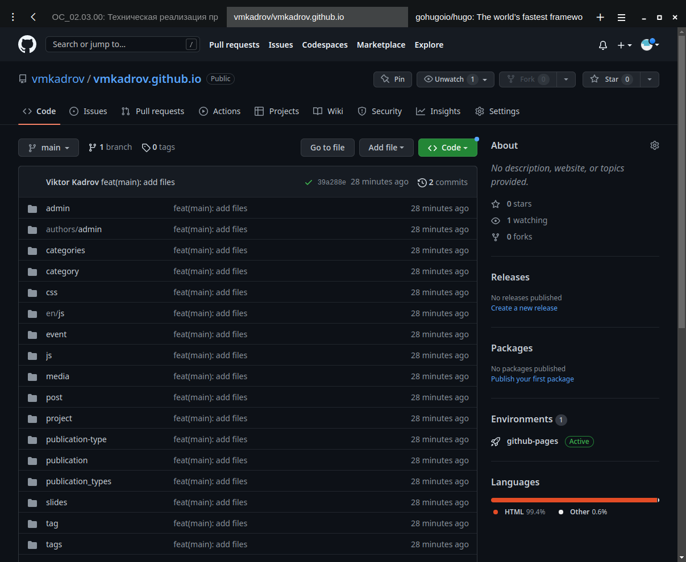

---
## Front matter
lang: ru-RU
title:  "Проект. Первый этап"
subtitle: "Создание личного сайта и запуск на платформе Github Pages"
author:
  - Виктор Максимович Кадров
  
## Formatting pdf
toc: false
toc-title: Содержание
slide_level: 2
aspectratio: 169
section-titles: true
theme: metropolis
header-includes:
 - \metroset{progressbar=frametitle,sectionpage=progressbar,numbering=fraction}
 - '\makeatletter'
 - '\beamer@ignorenonframefalse'
 - '\makeatother'
---

## Цель работы

Приобретение практических навыков создания статических сайтов при помощи Hugo. Работа с Github Pages

## Задание

1. Создание репозитория на основе шаблона
2. Генерация файлов при помощи Hugo
3. Создание репозитория для использования Github Pages

## Создание оcновного репозитория

Создаем репозиторий на основе шаблона в web-интерфейсе Github. Копируем его на свой компьютер.

{ #fig:001 width=40% }

## Генерация файлов

При помощи Hugo создаем необходимые файлы в папке blog/. Проверяем, что все было создано.

{ #fig:002 width=30% }

## Создание странички на Github

Создаем новый репозиторий, где будут храниться наши страницы.

{ #fig:003 width=40% }

## Выводы

В ходе выполнения лабораторной работы были приобретены практические навыкы создания статических сайтов при помощи Hugo и работы с Github Pages.

