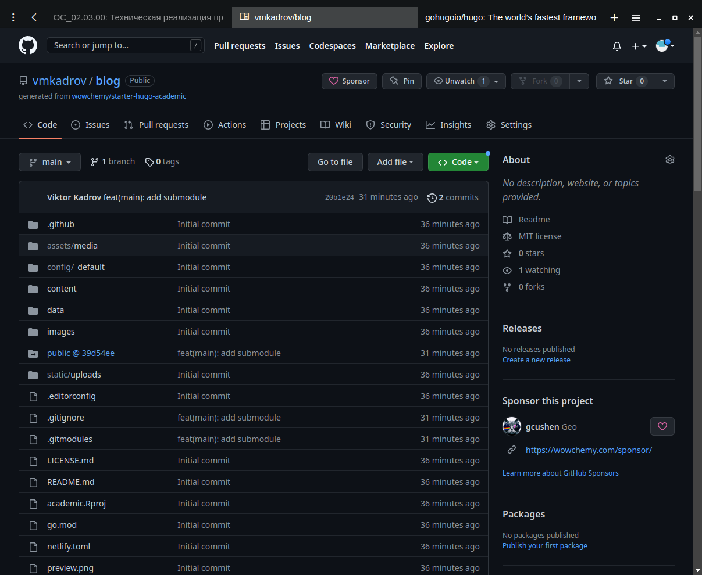
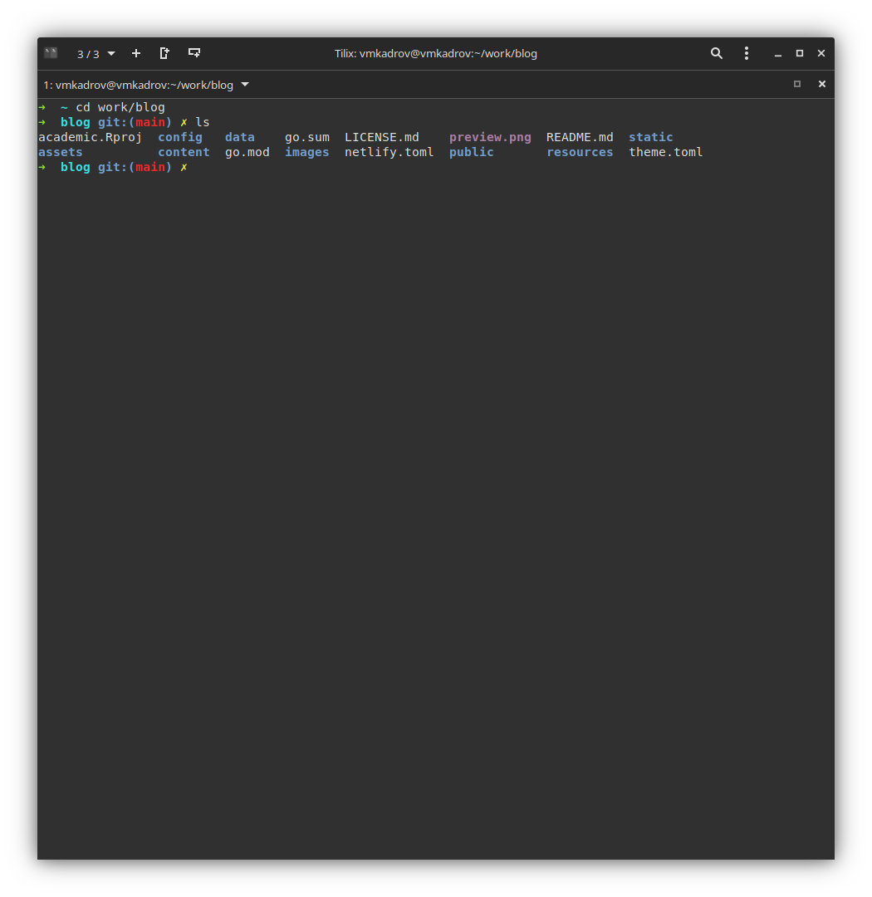
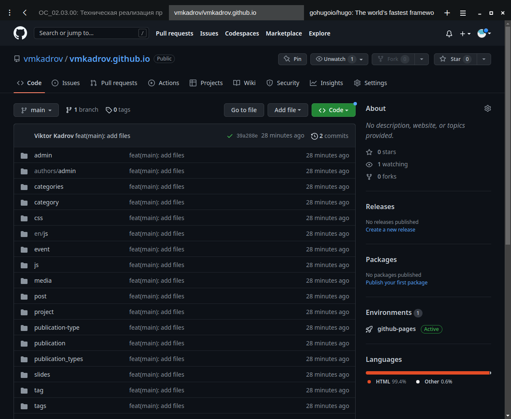

---
## Front matter
title: "Проект. Первый этап"
subtitle: "Создание личного сайта и запуск на платформе Github Pages"
author: "Виктор Максимович Кадров"

## Generic otions
lang: ru-RU
toc-title: "Содержание"

## Bibliography
bibliography: bib/cite.bib
csl: pandoc/csl/gost-r-7-0-5-2008-numeric.csl

## Pdf output format
toc: true # Table of contents
toc-depth: 2
lof: true # List of figures
lot: false # List of tables
fontsize: 12pt
linestretch: 1.5
papersize: a4
documentclass: scrreprt
## I18n polyglossia
polyglossia-lang:
  name: russian
  options:
	- spelling=modern
	- babelshorthands=true
polyglossia-otherlangs:
  name: english
## I18n babel
babel-lang: russian
babel-otherlangs: english
## Fonts
mainfont: PT Serif
romanfont: PT Serif
sansfont: PT Sans
monofont: PT Mono
mainfontoptions: Ligatures=TeX
romanfontoptions: Ligatures=TeX
sansfontoptions: Ligatures=TeX,Scale=MatchLowercase
monofontoptions: Scale=MatchLowercase,Scale=0.9
## Biblatex
biblatex: true
biblio-style: "gost-numeric"
biblatexoptions:
  - parentracker=true
  - backend=biber
  - hyperref=auto
  - language=auto
  - autolang=other*
  - citestyle=gost-numeric
## Pandoc-crossref LaTeX customization
figureTitle: "Рис."
tableTitle: "Таблица"
listingTitle: "Листинг"
lofTitle: "Список иллюстраций"
lotTitle: "Список таблиц"
lolTitle: "Листинги"
## Misc options
indent: true
header-includes:
  - \usepackage{indentfirst}
  - \usepackage{float} # keep figures where there are in the text
  - \floatplacement{figure}{H} # keep figures where there are in the text
---

# Цель работы

Приобретение практических навыков создания статических сайтов при помощи Hugo. Работа с Github Pages

# Задание

1. Создание репозитория на основе шаблона
2. Генерация файлов при помощи Hugo
3. Создание репозитория для использования Github Pages

# Теоретическое введение

Hugo - это статический генератор веб-сайтов в формате HTML и CSS, написанный на Go. Он оптимизирован с точки зрения скорости, простоты использования и конфигурируемости. Hugo берет каталог с контентом и шаблонами и превращает их в полноценный HTML-сайт.

В качестве метаданных Hugo использует файлы Markdown с front matter, и вы можете запустить Hugo из любого каталога. Это хорошо работает для общих хостов и других систем, где у вас нет привилегированной учетной записи.

# Выполнение лабораторной работы

## Создание оcновного репозитория

Создаем репозиторий на основе шаблона в web-интерфейсе Github (рис. [-@fig:001]). Копируем его на свой компьютер.

{ #fig:001 width=100% }

## Генерация файлов

При помощи Hugo создаем необходимые файлы в папке blog/. Проверяем, что все было создано (рис. [-@fig:002]).

{ #fig:002 width=100% }

## Создание странички на Github

Создаем новый репозиторий, где будут храниться наши страницы (рис. [-@fig:003]).

{ #fig:003 width=100% }

# Выводы

В ходе выполнения лабораторной работы были приобретены практические навыкы создания статических сайтов при помощи Hugo и работы с Github Pages.

